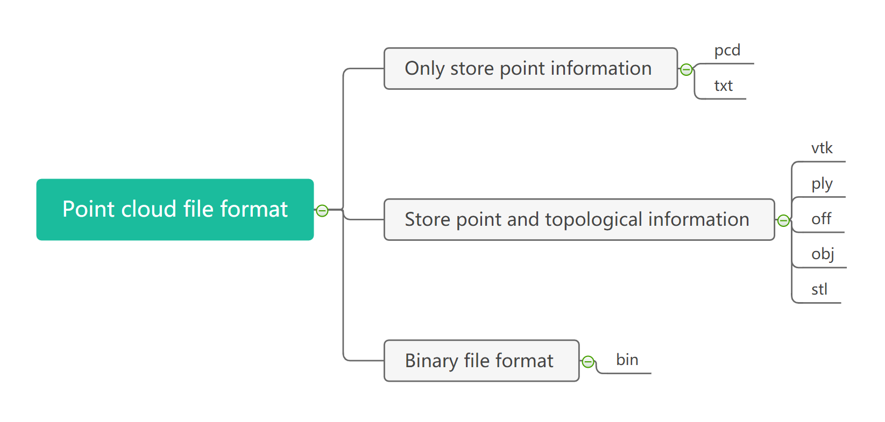
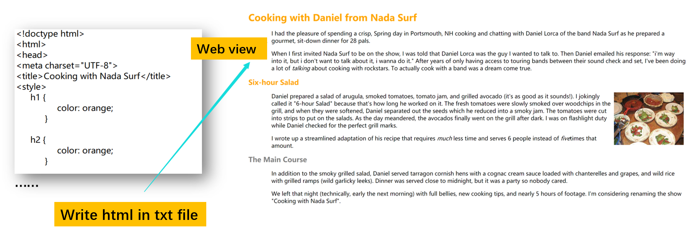
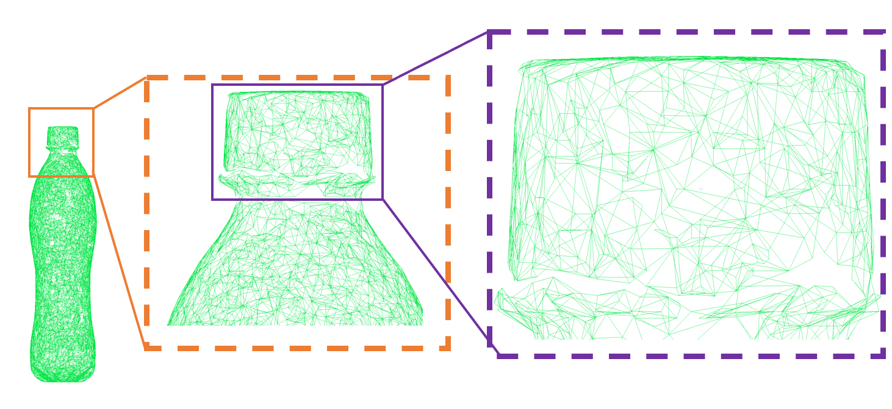
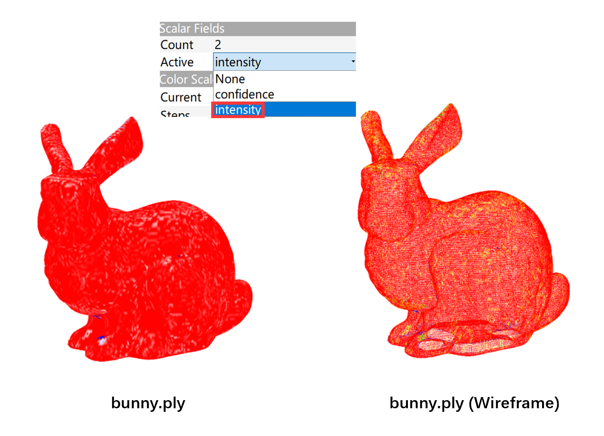
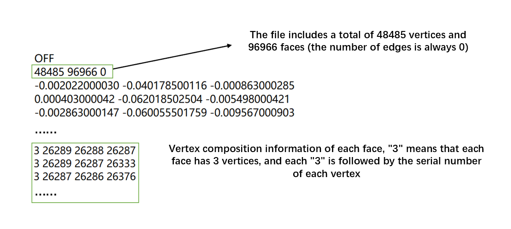
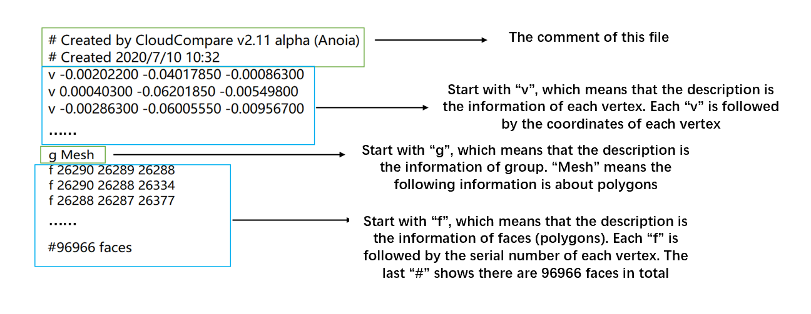
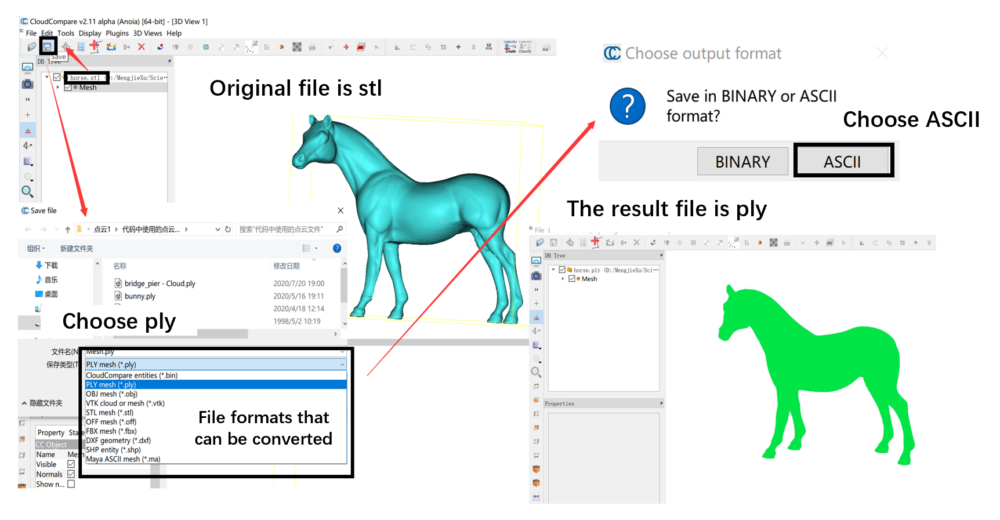

[TOC]


## Chapter3   Point cloud file format

In Chapter 2, we introduced the basic operations of two open-source point cloud software. These operations are based on **opening the corresponding point cloud or mesh file in the software**. So what information is stored in these files? What is the difference between the internal structure of the file and other data? In Chapter 3, we will discuss the **internal composition and interpretation of these documents**.

This chapter mainly introduces **the different formats of point cloud storage**. With the rapid development of science and technology, the hardware technology used to collect point cloud and the software algorithms for analyzing point cloud data are updated continuously, and many point cloud file formats have emerged. Different file formats have different application scenarios and processing methods. Here are some of the file formats (divided into three categories):



*Fig.3.1:   Point cloud file format*

***PCD：***`Point Cloud Data, PCL (Point Cloud Library) officially designated file, which is used to store the specific information of the point cloud (PCL (Point Cloud Library) is a C++ library for processing point clouds. There will be a special explanation in Chapter 4);`

***TXT：***`It is used to store the point information of the point cloud, and the operation is simple, consistent with the txt file processing method we usually process data;`

***VTK：***`In addition to storing point information, it also stores the topological relationship between points (topological relationships are explained in section 3-3);`

***PLY：***`Three-dimensional mesh model data format, only used to describe a polygon model object, that is, a mesh structure model;`

***OFF：***`It is used to save the polygon information of the geometry;`

***OBJ：***`The geometrically defined file format mainly supports polygonal models, that is, mesh structure models;`

***STL：***`It is used to store point information and topological information, representing a closed surface or volume;`

***BIN：***`Different from the above seven kinds of files, a file with a suffix of .bin just wants to show that it is in binary format. But it does not mean that it is necessarily related to a certain application, and a bin file may not be point cloud data;`

... 

There are many other formats, not to list them all here.

​                                                                      **—— Let us find out!——**


### 3-1：PCD

#### PCD (Point Cloud Data)

The pcd file format is officially designated by PCL (Point Cloud Library), which is used to store each point's specific information in the point cloud.

The pcd file format was produced because the existing file structure did not support certain extended operations in the processing of the n-dimensional point type mechanism introduced by the PCL. The existing files at that time did not meet the operating requirements of the PCL, and the pcd file format can make up for this defect. Therefore, the point cloud file format is always "come into being."

Fig.3.1.1 is the description of the **bridge_pier.pcd** in the "files" folder, which is a pier of the **bridge.bin** we showed in Chapter 1. We use the cutting operation of CloudCompare in Chapter 2 to extract the pier part from the entire bridge.


*Fig.3.1.1:   **bridge_pier.pcd** view*

The following figure is the specific content of the **bridge_pier.pcd**:

> NB: In the **DATA ascii** line in the figure below, if the data saving encoding method is ascii, notepad opening is not garbled; if the data saving encoding method is binary, opening with notepad is garbled. So **it is not recommended to use notepad to view the internal content of binary data files**, but the binary format does not affect file processing.


*Fig.3.1.2:   **bridge_pier.pcd** content*

The first 11 lines are the structure settings of this file, which is the header of pcd. It is very different from the files we have seen before, so what do they mean? The detailed description is as follows:

**#.PCD v0.7 - Point Cloud Data file format:** pcd comment part, "#" comment style is similar to python single-line comment style;

**VERSION:** It describes the version of the pcd file. The official version of PCL is 0.7 (PCD_V7), which is the same as the example **bridge_pier.pcd**;

**FIELDS:** The FIELDS line can give us very important information. It explains the field or dimension name in each point in the file, that is, what information each point contains. Here are three examples:

```
1.   FIELDS x y z
2.   FIELDS x y z rgb
3.   FIELDS x y z rgb normal_x normal_y normal_z curvature
...
```

1. The first line indicates that each point contains three fields, namely: x (the x coordinate of each point); y (the y coordinate of each point); z (the z coordinate of each point)

2. The second line indicates that each point contains four fields, namely: x (x coordinate of each point); y (y coordinate of each point); z (z coordinate of each point); rgb (color information of each point) )

3. The third line indicates that each point contains eight fields, namely: x (x coordinate of each point); y (y coordinate of each point); z (z coordinate of each point); rgb (color information of each point) ); normal_x (normal vector x value); normal_y (normal vector y value); normal_z (normal vector z value); curve (curvature of each point)

4. ...

   There are many other situations besides

Our sample file is consistent with the second line, including the xyz coordinate value of each point and the rgb color information;

**SIZE:**  It explains the number of bytes occupied by each field or dimension, for example:

- **unsigned char/char --** 1 byte;
- **unsigned short/short --** 2 bytes;
- **unsigned int/int --** 4 bytes;
- **double --** 8 bytes;

**TYPE:**  It describes the data type of each field or dimension, for example:

- **I --** Signed;
- **U --** Unsigned;
- **F --** Float;

**COUNT:**  It describes the number of elements in each field or dimension, for example:

- ***x*** **--** 1 element;
- ***VFH*** **--** 308 elements;

Generally speaking, if **COUNT** is not marked, the number of elements in all fields is 1.

**WIDTH:**  It means the width of the file, which has two meanings:

- ***Unorganized(unordered) point cloud:*** Number of all points (equals to **POINTS**) ;
- ***Organized(ordered) point cloud:*** The width of the data, which is equal to the total number of points in a row; 

> Regarding organized point cloud and unorganized point cloud, we will explain them later in this section. 

**HEIGHT:** Corresponding to the above width, it indicates the height of the file data. There are two meanings:

- ***Unorganized point cloud:\*** Always 1;
- ***Organized point cloud:\*** The width of the data, which is equal to the total number of rows; 

**VIEWPOINT:** It explains the point cloud collection viewpoint. The default value is "0,0,0,1,0,0,0";

**POINTS:** The total number of point cloud data, whether it is an unorganized point cloud or an organized point cloud, satisfies the following formula

The total number of point cloud data, whether it is an unorganized point cloud or an organized point cloud, satisfies the following formula (1):
$$
POINTS = WIDTH × HEIGHT
$$
**DATA:**  It means the data storage format: ascii or binary.


*Fig.3.1.3:   data part of **bridge_pier.pcd***

Starting from line 12 is the data part of the file, as shown in Fig.3.1.3. **Each row represents a point's information**. The information that each point has corresponds to **FIELDS** (the third row). Here our document contains x, y, z, and rgb information. Take the first line of data as an example:

- 11.914234 corresponds to the x coordinate of the first point;

- 41.192451 corresponds to the y coordinate of the first point;

- 147.39807 corresponds to the z coordinate of the first point;

- 33095679 corresponds to the rgb information of the first point;

  > NB: The rgb here is one number, not three numbers between 0 and 255 because the three values of rgb are combined into a U-type value through bit operations.

The following points can be deduced by analogy.

> NB:
>
> - The presence of nan in the data part means that the data at that point is **illegal** or **does not exist**;
> - Do not add comments randomly in the pcd file, as this will cause the file to become invalid and inoperable, and it is impossible to view and process in CloudCompare;

Open **bridge_pier.pcd** in the "files" folder in notepad format, and we can see the file content in Fig.3.1.2. Open it in CloudCompare and view it, and we can see the view of each angle of the point cloud, as shown in Fig.3.1.4:


*Fig.3.1.4:   **bridge_pier.pcd** view*

> NB: Regarding the ***organized point cloud*** and ***unorganized point cloud*** mentioned in Fig.3.1.2, a brief introduction is given below. At present, most point clouds we encounter are unorganized point clouds.


#### Organized point cloud and unorganized point cloud

- Organized point cloud: The structure is similar to a **matrix**, with **width and height**, **arranged in order**, so we can quickly find information about neighboring points (The reason for the different shapes is that the organized point cloud contains invalid points, and the invalid point coordinates are generally marked as (0,0,0));
- Unorganized point cloud: The data points are arranged **without any order**. They are randomly distributed in space.

As shown in Fig.3.1.5, there are unorganized point clouds on the left and organized point clouds on the right. From a visual perspective, we can see that the organized point clouds are arranged more neatly, while the unorganized point clouds are relatively messy (Understand roughly is okay):


*Fig.3.1.5:   Unorganized point cloud and organized point cloud[^1][^2]*


### 3-2 ：TXT

#### Background

We have processed a lot of data in txt files before learning point cloud. For example, data in Excel can be exported to txt:


*Fig.3.2.1:   Excel and txt*

Web page files can also be written in txt and saved as Html:



*Fig.3.2.2:   Html and txt*

In short, txt is widely used and easy to operate. So what is the internal structure when it is used to store the point cloud? What is the difference with pcd?


#### TXT content

The txt file, like pcd, is also a file storing **point information** in the point cloud. As mentioned in the introduction of pcd, txt files **do not support some extensions in processing the n-dimensional point type mechanism introduced by the PCL**. Therefore, we generally choose the pcd version instead of txt when using the algorithms of the PCL. The following figure is a screenshot of the internal part of the **bridge_pier.txt** (see in "files" folder):


*Fig.3.2.3:   **bridge_pier.txt** content*


#### Features of TXT

- There is generally no file header in the txt file (This does not mean that txt files cannot add file header. If the user sets a similar file header, we must **skip** these file headers when processing the txt file, and only process the data part);

- When dragging the txt file into CloudCompare, a selection box will pop up. For the options in the selection box (as shown on the right side of the arrow in Fig.3.2.4): coord.X, coord.Y, coord.Z, Nx, Ny, Nz, Red, Green, Blue, etc. Please choose according to our situation. For example, the first column of our data is the R-value of each point. The second column is the G-value, but when we drag the txt file into CloudCompare, select the first column as the G-value (Green) and the second column as the R-value (Red), an image that does not match our expectations will be displayed. Therefore, we must choose according to the **actual situation** of our data.

- When we drag the **bridge_pier.txt** (in "files" folder) into CloudCompare, the selection box is as shown below:

  

​         *Fig.3.2.4:   txt file selection box*

We can see that each column of data originally in the txt has an indicator in the blue box. Click the drop-down box in the red box of each indicator to select our own corresponding attributes (shown on the right in Fig.3.2.4). Here we choose coord.X in the first column, which means that the first column is displayed as the X coordinate of each point, the following columns, etc. As long as we choose the right one, click Apply, and we can see the txt view files from various angles in the canvas of CloudCompare:


*Fig.3.2.5:   **bridge_pier.pcd** view*

We can find that the view of **bridge_pier.txt** is the same as the previous view of **bridge_pier.pcd**. This is indeed the case because these two files represent **the same bridge pier point cloud**. Here **bridge_pier.txt** is transformed from **bridge_pier.pcd**. The difference is only in the file format. We will introduce the transformation of different file formats in Section 2-8 and Chapter4.

There is nothing special about the primary processing of txt files. We only need to master the txt statement in python or C++, realizing the necessary processing of txt version point cloud data.


### 3-3 ：VTK

#### Introduction to VTK

The difference from the previous two is that in addition to the point information, the vtk file can also include topological relationship information (It does not have to include, but it **can** include). For example, the connection between the points and the lines form a surface. Its structure is slightly more complicated than the previous two files. Since the content stored in the vtk file is different from pcd and txt, it is generally used when the line and surface information of the geometry needs to be used.

> NB: The vtk file stores much more information than pcd and txt. However, it does not mean that it is a more advanced file format. As we mentioned at the beginning of this chapter, each file format's generation has its application scenarios. Although both pcd and txt only contain point information, the corresponding file format needs to be used in specific scenarios. For example, PCL specifies the use of pcd files. So there is no difference between them. The key is that we use the appropriate file formats according to the situation to maximize their effectiveness.


#### Topological relationship

Topological relationship refers to the mutual relationship between spatial data satisfying the principles of topological geometry. Nodes, arcs, and polygons represent the adjacency, association, containment, and connection between entities. Such as: point-to-point adjacency relationship, point-to-surface inclusion relationship, line-to-surface separation relationship, surface-to-surface overlap relationship, etc[^3]. Fig.3.3.1 is an example of the topological relationship:


*Fig.3.3.1:   Topological relationship[^4]*


#### VTK view and explanation

Let us take a simple vtk file as an example to explain the internal information:

Take **cube.vtk** (see in "files" folder) as an example, this is a cube with side length 1. Fig.3.3.2 is the view of the cube in CloudCompare (Here we choose the view with Wireframe, which is convenient to see polygon. This type of view is explained in Fig.3.3.3) and the content of the corresponding vtk file:


*Fig.3.3.2:   View and content of **cube.vtk***

The following explains the contents of the vtk file:

**vtk output**: The title of this vtk file, set by ourselves, up to 256 characters;

**DATASET POLYDATA**: DATASET means that what is followed is the data format, and POLYDATA is the polygon format. In addition to POLYDATA, there are other formats, such as STRUCTURED_POINTS, etc.;

**POINTS 8 float**: It means that there are a total of eight point data of float type. As shown by the arrow in Fig.3.3.2, the eight circles on the left correspond to the cube's eight points. The data between POINTS 8 float and VERTICES 8 16 is the XYZ information of eight points, and each row is the XYZ information of each point;

**VERTICES 8 16**: It means that eight points are selected as vertices among all the points in this file. (It should be noted that the number of vertices here is eight, which happens to be equal to the total number of points in Points 8 float. That is, all the points in this file are selected as vertices. In actual situations, the number of points selected as vertices is less than or equal to the total number of points);

16 means that the vertex part below contains a total of 16 numbers;

The first column is eight "1"s, which means there is one data after each "1";

The second column is to name the serial numbers of the eight vertices;

**POLYGONS 12 48**: It means that a total of 12 polygons are formed in this file, so there are 12 rows of data below, and each row represents a face;

The 12 "3"s in the first column means that there are three data after each "3";

The second column to the fourth column represent each face's vertex number (corresponding to the VERTICES part). Since each face here is composed of three vertices, the 12 faces here are all triangles;

48 refers to a total of 48 data in these four columns;

As shown by the arrow in Fig.3.3.2, the blue triangle is one of the 12 triangles. The cube has six faces, and each face is a square. In Fig.3.3.2. On the left, we can see that each square is composed of two isosceles triangles, so there are 12 triangles in total, which are 12 polygons.

Besides, vtk also has other complex information, such as color, etc.

Fig.3.3.3 shows the display result of **cube. vtk** in CloudCompare (the green cube in the upper left corner) and the polygon display after the Wireframe in Mesh is selected (the mesh view in the lower right corner). We can see 12 small triangles in the mesh view:


*Fig.3.3.3:   vtk and Wireframe*

Fig.3.3.4 is a more complicated vtk file view. By zooming in on the partial view, it helps us to understand Wireframe better, that is, the mesh structure:



*Fig.3.3.4:   Wireframe*


### 3-4 ：PLY

#### PLY view

The ply file format is a set of 3D mesh model data format developed by Stanford University. It is similar to the vtk file and stores polygon model objects. We first view a ply file in CloudCompare: **bunny.ply** (see in "files" folder). The following selection box will appear when we drag the **bunny.ply** into CloudCompare, as shown in Fig.3.4.1.

We have seen a similar selection box when viewing the txt file before. The function is **"CloudCompare is asking you how to display the imported file."** Here we see Fig.3.4.1. The red box is the information contained in **bunny.ply**. At this time, we must open our ply file to see what information is contained in the file (Fig.3.4.4), then set the selection box here.

For example, lines 9 and 10 in Fig.3.4.4 —— **property float32 confidence** and **property float32 intensity** show that this file contains confidence and intensity information, so choose to display confidence and intensity information in Scalar. Click Apply after the correct selection, we can see the correct view.


*Fig.3.4.1:   ply selection box*

In Scalar, we added intensity and confidence, and we can choose to view one of them when viewing in CloudCompare.

Show the view when Scalar Field is intensity:



*Fig.3.4.2:   **bunny.ply** view 1 (intensity)*

Show the view when Scalar Field is confidence:


*Fig.3.4.3:   **bunny.ply** view 2 (confidence)*


#### PLY content

Next, open the **bunny.ply** in the Notepad format and intercept part of the file content for the explanation. As shown in Fig.3.4.4:


*Fig.3.4.4:   **bunny.ply** content*

**ply**: `Represents this file format is ply file;`

**format ascii 1.0**: `ascii represents the data format, 1.0 represents the ply format version is 1.0;`

**comment zipper output** and **comment modified by flipply**: `File comment, what follows "comment" is the comment of ply file;`

**element vertex 35947**: `Vertex elements, a total of 35947 vertices;`

**property float32 x**: `The data contains the x coordinate value of each vertex;`

**property float32 y**: `The data contains the y coordinate value of each vertex;`

**property float32 z**: `The data contains the z coordinate value of each vertex;`

**property float32 confidence**: `The data contains the credibility of each vertex;`

**property float32 intensity**: `The data contains the light intensity of each vertex;`

**element face 69451**: `There are 69451 faces in the file;`

**property  list  uint8  int32  vertex_index**:  `The vertex index is a list of integers;`

**end_header**: `The end of the above description;`

**After "end_header"**:  `Ply data content. The yellow part is vertex data, including five columns, corresponding to each vertex's x, y, z, confidence, and intensity. The red part is the face's information, as in vtk, the first three means that these are all triangles, followed by the serial number corresponding to each triangle vertex. `


### 3-5：OFF

off (Object File Format), similar to vtk and ply files. The off file represents the geometry of the model by specifying the polygons on the surface. That is, the mesh model. The polygon here can have any number of vertices.

> NB: This file is saved in ASCII encoding.
>

#### OFF content

```
OFF 
vertices number  pologons number  edges number
x y z
x y z
... remaining vertices information
vertices number v1 v2 v3 ... vN
... remaining faces information
```

The following is the description of each part of the off file:

- Every off file starts with OFF;
- Next, display the number of vertices, the number of polygons, that is, the number of faces, and the number of edges (the number of edges is always 0);
- Then display the coordinate information (x, y, z) of each point;
- The last is the face information, including the number of vertices and the serial number corresponding to each vertex;


#### Example 1

**cube.off**: A small cube with side length 1 (see in the "files" folder)


*Fig.3.5.1:   **cube.off** content*

The following figure shows the different view of **cube.off** in CloudCompare: the left is the default view, and the right is the Wireframe view:


*Fig.3.5.2:   **cube.off** view*

The way of presenting the Wireframe view is the same as that described in vtk. Check the Wireframe column in Properties is okay.


#### Example 2

**horse.off**:  A horse (see in the "files" folder)



*Fig.3.5.3:   **horse.off** content*

The following figure shows the different view of **horse.off** in CloudCompare: the left is the default view, and the right is the Wireframe view:


*Fig.3.5.4:   **horse.off** view*

The way of presenting the Wireframe view is the same as that described in vtk. Check the Wireframe column in Properties is okay.

Supplementary reading in this section: https://shape.cs.princeton.edu/benchmark/documentation/off_format.html


### 3-6：OBJ

obj file is a format developed by Wavefront Technology Company for a software "Advanced Visualizer". The file format can include the coordinate and normal information of each vertex, the face (polygon), etc.

When we introduced the pcd file, we said that its file header part could show much important information, but the obj file does not need a file header. It can add some comments through "#".


#### OBJ keywords

The following are some examples of common keywords in obj files:

| Keywords   | Meanings                              |
| ---------- | ------------------------------------- |
| v          | Vertex information of geometry        |
| vn         | Normal information of geometry vertex |
| f          | Surface (polygon information)         |
| l          | Line information                      |
| g          | The name of the group                 |
| **......** | **......**                            |


#### OBJ content

The following is a simple obj file internal information (open with Notepad):

> **horse.obj** (see in "files" folder)



*Fig.3.6.1:   **horse.obj** content*


#### OBJ view


*Fig.3.6.2:   **horse.obj** view*

This view is the same as the **horse.off** view. The difference between the two is that the stored file format is different.

Supplementary reading in this section:

- http://paulbourke.net/dataformats/obj/
- https://en.wikipedia.org/wiki/Wavefront_.obj_file


### 3-7：STL

stl is the abbreviation of "stereolithography", a file format used initially in computer-aided design software for stereolithography, which is created by 3D Systems Software. It can only be used to represent a closed surface or volume. There are two encoding methods for stl files: ASCII and binary.


#### ASCII

```
// file name
solid name
// Normal coordinates pointing to the outside of the geometric entity
facet normal ni nj nk
// The following three rows are the coordinates of the 3 vertices of triangle 
outer loop
// The 3 vertices are arranged counterclockwise in the direction of the normal vector pointing to the exterior of the geometric
vertex v1x v1y v1z
vertex v2x v2y v2z
vertex v3x v3y v3z
// The end of loop
endloop
// The end of facet
endfacet
......
// The end of whole file
endsolid name
```

From **facet normal ni nj nk** to **endfacet** is the triangular face's information, and the stl 3D model is composed of many such triangular faces.

Take an stl file with ASCII encoding as an example:

> **horse.stl** (see in the "files" folder)


*Fig.3.7.1:   **horse.stl** content*

Since the stl file contains normal information, its view also has the rendering effect of normal information:


*Fig.3.7.2:   **horse.stl** view (with normal)*


#### Binary (Just understand)

```
UINT8[80] – file name
UINT32 – the number of triangle
foreach triangle   the information of each triangle
REAL32[3] – normal
REAL32[3] – vertex 1 coordinate
REAL32[3] – vertex 2 coordinate
REAL32[3] – vertex 3 coordinate
UINT16 – file arrtibutes
......
end  the end of this file
```


### 3-8：Conversion of different file formats

Earlier, we introduced in detail seven different point cloud file formats. Because different file formats have different application scenarios, the same point cloud sometimes requires multiple file format version data. The mutual conversion between file formats is significant. How to perform file format conversion?

There are generally two methods:

- By coding: This method involves some header files in the PCL (we need to configure the PCL environment and install the C++ compiler), so we will introduce the transformation of this method in Chapter 4;
- By software: Compared with code conversion, software conversion is quick, simple, and easy to master. Here we mainly introduce the file format conversion operation in CloudCompare.


#### By coding

> see in Chapter4


#### By software

Take the **bridge_pier.pcd** file as the original file for conversion example:


*Fig.3.8.1:   conversion between pcd and bin*

Similarly, other file formats, such as vtk, ply, txt, can be operated similarly. Just select the corresponding file format in the **"File formats that can be converted"** box. If we want to reverse the conversion, it is the same operation. We can choose other file formats when saving.

We may notice that the off, stl, and obj file formats we introduced are not included in the options. Why?

There are two situations:

1. The pcd file cannot be converted into this kind of file format in CloudCompare. At this time, we may need to use other software or code to achieve;
2. These files cannot be converted by themselves. Neither code nor software can be converted.


When we use a different file format as the original file, the file format in the pop-up "File formats that can be converted" box is different. This is also because some file formats can be converted to limited file formats. Let us take **horse.stl** as an example:



*Fig.3.8.2:   conversion between stl and ply*

At this time, we see that **"File Formats That Can Be Converted"** in Fig.3.8.2 is different from **"File Formats That Can Be Converted"** in Fig.3.8.1. The same is true for other file formats, so let us try it out!


> The above are all the file formats we have introduced in this chapter. There are many file formats for storing point clouds. We will encounter them one by one in future algorithm processing. We hope everyone learns to accumulate, master the inner meaning of point cloud data. In the next chapter, we will introduce the magical PCL and look at the point cloud's many processing algorithms!


### Reference

[^1]: Hoppe, C., & Krömker, S. (2009). Adaptive meshing and detail-reduction of 3D-point clouds from laser scans. *International archives of photogrammetry, remote sensing and spatial information sciences*, *38*(5).
[^2]: Popescua, D., Popistera, F., Popescua, S., Neamtua, C., & Gurzaua, M. (2014). Direct toolpath generation based on graph theory for milling roughing. *Procedia CIRP*, *25*, 75-80.
[^3]: [https://baike.baidu.com/item/%E6%8B%93%E6%89%91%E5%85%B3%E7%B3%BB](https://baike.baidu.com/item/拓扑关系)
[^4]:https://www.pinterest.com/pin/493073859183245037/