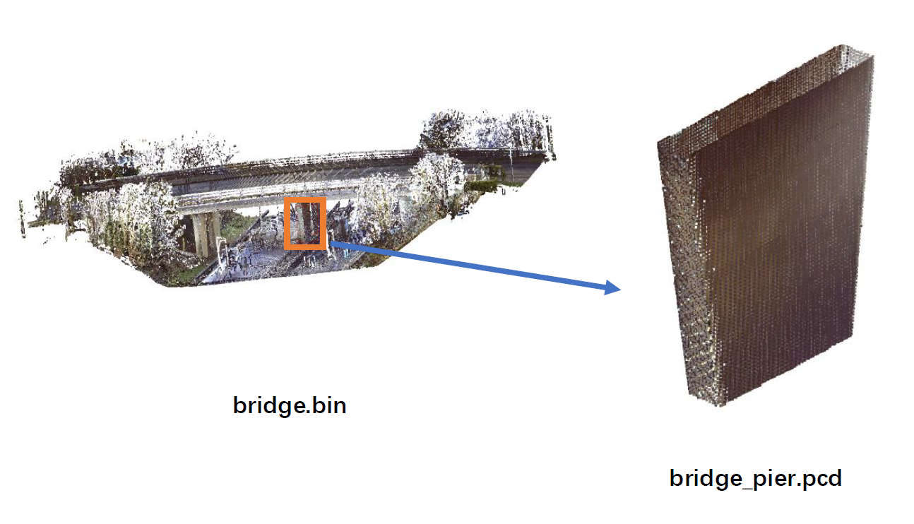
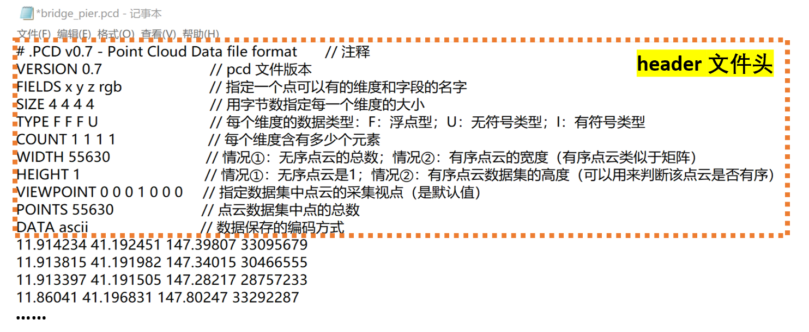
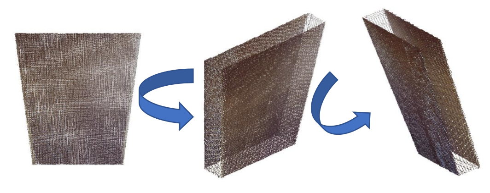
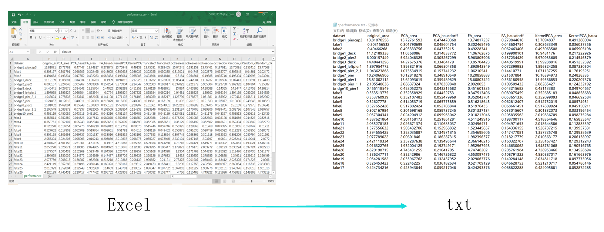
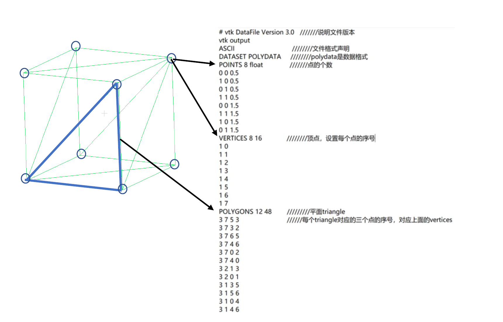
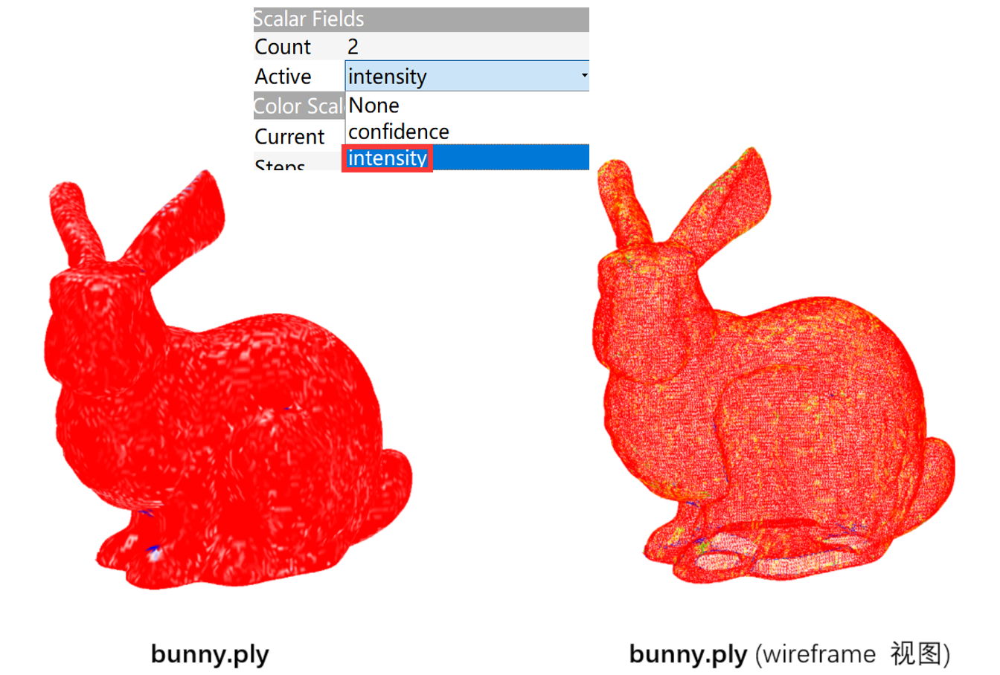
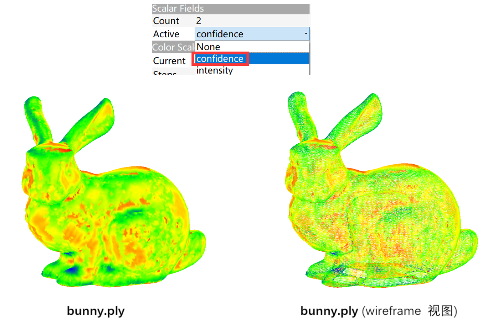
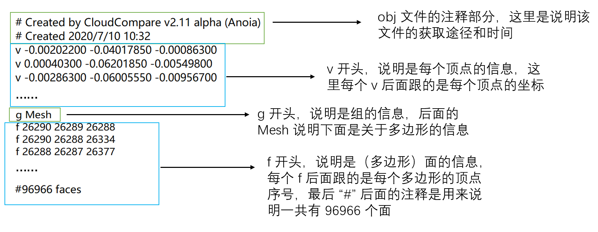

[TOC]


## 第三章   点云文件格式

第二章我们介绍了两种开源点云软件的基本操作，这些操作都是基于**在软件中打开相应点云或者网状结构（mesh）文件**而进行的。那么这些文件都储存了什么信息？文件内部结构又与其他数据有什么区别？第三章我们就来探讨这些文件**内部的构成和解读**：

本章主要介绍**点云存储的不同格式**：随着科学技术日新月异，用来采集点云的硬件技术以及分析点云数据的软件算法都在不断更新，许多点云文件格式应运而生。不同的文件格式有不同的应用场景和处理方法，下面列举其中部分文件格式（分为三类）：


​                                                                       图 3-1：点云文件格式

***PCD：*** `Point Cloud Data，PCL (Point Cloud Library) 官方指定文件，用于存储点云中点的具体信息 (PCL (Point Cloud Library) 是 C++ 处理点云的库，第四章中会有专门讲解)；`

***TXT：***`用来存储点云的点的信息，操作简单，与我们平时处理数据的 txt 文件处理方式一致；`

***VTK：***`除了存储点的信息，还存储点与点之间的拓扑关系（拓扑关系在 3-3 VTK 文件中有说明）；`

***PLY：***`三维 mesh 模型数据格式，只用于描述一个多边形模型对象，也即网格结构模型；`

***OFF：***`保存几何体的多边形信息；`

***OBJ：***`从几何学上定义的文件格式，主要支持多边形模型，也即网格结构模型；`

***STL：***`存储点的信息以及拓扑信息，表示封闭的面或者体；`

***BIN：***`与上述七种文件不同，一个后缀名为 .bin 的文件, 只是想表明它是 binary 格式. 但并不表明它与某种应用程序有必然的联系性，一个 bin 文件也可能不是点云数据；`

......  还有其他多种格式，这里不做一一列举。


​                                                                     **—— 一起来一探究竟吧！——**


### 3-1：PCD 文件

#### PCD 文件（Point Cloud Data）

pcd 文件格式是 PCL（Point Cloud Library）官方指定文件，用于存储点云中每个点的具体信息。

pcd 文件格式的产生，是因为当时已有的文件结构不支持由 PCL 库引进 n 维点类型机制处理过程中的某些扩展操作，也即当时已有的文件不满足 PCL 库的操作要求，而 pcd 文件格式能够很好地弥补这一缺陷。所以说，点云文件格式总是 “应运而生”。

图 3-1-1 是教程文件夹中 **bridge_pier.pcd** 文件说明，它是我们在第一章中展示的 **bridge.bin** 桥体的一个桥墩。我们用第二章 CloudCompare 的切割功能将桥墩部分从整座桥中提取出来。



​                                                              图 3-1-1：**bridge_pier.pcd** 文件说明

下图 3-1-2 是 **bridge_pier.pcd** 文件具体内容：

> 注意：下图中的 **DATA ascii** 行，如果数据保存编码方式是 ascii，记事本打开不是乱码；如果数据保存编码方式是 binary（二进制），则用记事本打开是乱码。所以**不推荐用记事本查看 binary 数据文件的内部内容**，但 binary 格式并不影响文件的处理。



​                                                                 图 3-1-2：**bridge_pier.pcd** 文件内容

前 11 行是对此文件的结构设置，是 pcd 文件头（header）。跟我们以前见过的文件很不一样，那么它们都代表什么意思呢？详细说明如下：

**#.PCD v0.7 - Point Cloud Data file format:**  pcd 注释部分，“# ”注释风格类似于 python 单行注释风格；

**VERSION:**  说明该 pcd 文件的版本。PCL 官方版本是 0.7（PCD_V7），与这里的例子 **bridge_pier.pcd** 一样；

**FIELDS:**  FIELDS 这一行可以给我们非常重要的信息。说明该文件中每个点包含的字段或维度名称，也即每个点都包含什么信息，下面是三个例子：

```
1.   FIELDS x y z
2.   FIELDS x y z rgb
3.   FIELDS x y z rgb normal_x normal_y normal_z curvature
...
```

1. 第一行说明每个点包含三个字段，分别是：x（每个点 x 坐标）；y（每个点 y 坐标）；z（每个点 z 坐标）
2. 第二行说明每个点包含四个字段，分别是：x（每个点 x 坐标）；y（每个点 y 坐标）；z（每个点 z 坐标）；rgb（每个点的颜色信息）
3. 第三行说明每个点包含八个字段，分别是：x（每个点 x 坐标）；y（每个点 y 坐标）；z（每个点 z 坐标）；rgb（每个点的颜色信息）；normal_x（法向量 x 值）；normal_y（法向量 y 值）；normal_z（法向量 z 值）；curvature（每个点的曲率）
4. ...... 除此之外还有其他很多种情况

这里我们的示例文件与第二行情况一致，包含每个点的 xyz 坐标值以及 rgb 颜色信息；

**SIZE:**  说明每个字段或维度所占据的字节数，例如：

- **unsigned char/char --** 1 个字节;
- **unsigned short/short --** 2 个字节;
- **unsigned int/int --** 4 个字节;
- **double --** 8 个字节；

**TYPE:**  说明每个字段或维度的数据类型，例如：

- **I --** Signed；
- **U --** Unsigned；
- **F --** Float；

**COUNT:**  说明每个字段或维度的元素个数，例如：

- ***x*** **--** 1 个元素；
- ***VFH*** **--** 308 个元素；

通常来说,  如果 **COUNT** 没有标明, 所有字段的元素个数都为 1。

**WIDTH:**  说明文件数据的宽度，有两种含义：

- ***无序点云*** 中全部点的个数（与下面要解释的 **POINTS** 个数相等） ;
- ***有序点云*** 中数据的宽度，等于一行点的个数； 

> 关于有序点云和无序点云，本节稍后会补充解释，这里暂且理解为两类不同结构的点云数据。

**HEIGHT:**  对应上面的宽度，说明文件数据的高度，有两种含义：

- ***无序点云*** 中始终是 1；
- ***有序点云*** 中数据的高度，等于行的个数； 

**VIEWPOINT:**  说明点云的采集视点。默认值是 "0,0,0,1,0,0,0"；

**POINTS:**  点云的全部数据个数，无论是无序点云还是有序点云，都满足下列公式（1）：
$$
POINTS = WIDTH × HEIGHT
$$
**DATA:**  说明数据存储格式： ascii 或者 binary。


​                                                    图 3-1-3：**bridge_pier.pcd** 文件内容 —— 数据部分

从第 12 行开始就是文件的数据部分，体现在图 3-1-2 中是后四行数据。图中只是截取了点云文件数据部分的前四个点。数据部分**每一行代表一个点的信息**，每个点有什么信息与 **FIELDS**（第三行）对应。在这里我们的文档是包含 x，y，z，rgb 信息，以数据部分的第一行为例：

- 11.914234 对应第一个点的 x 坐标；

- 41.192451 对应第一个点的 y 坐标；

- 147.39807 对应第一个点的 z 坐标；

- 33095679 对应第一个点的 rgb 信息；

  > 注意：这里的 rgb 为一个数值，而不是三个 0~255 之间的数字，是因为这里将 rgb 三个值通过位运算合为一个 U 类型的数值

后面的点以此类推。


> 注意：
>
> - 数据部分出现 nan，即意味着该点数据**不合法**或者**不存在**；
> - 在 pcd 文件中不要随意乱加注释，这样会导致文件失效无法操作，无法在 CloudCompare 中进行视图和相关处理；


用记事本格式打开教程文件夹中的 **bridge_pier.pcd**，便可看到图 3-1-2 中的文件内容。将其在 CloudCompare 中打开进行视图，可以看到点云文件各个角度的直观表示，如图 3-1-4 所示：



​                                      图 3-1-4： **bridge_pier.pcd** 在 CloudCompare 中不同角度的视图


> 注：关于图 3-1-2 中提到的 ***有序点云*** 和 ***无序点云*** ，下面给出简单介绍，目前我们遇到的大多数点云都是无序点云。


#### 有序点云和无序点云：

- 有序点云：结构类似于**矩阵**，有**宽度和高度**，**按照顺序排列**，因此可以很快地查找临近点信息（之所以呈现不同形状是因为有序点云中包含无效点，无效点坐标一般都被标记为 (0,0,0)）；


- 无序点云：数据点排列**没有任何顺序**，杂乱地分布在空间中。


如图 3-1-5 所示，左侧都是无序点云，右侧为有序点云，从视觉上我们可以看到有序点云排列更加整齐，而无序点云相较而言比较杂乱（大体理解即可）：


​                                                             图 3-1-5：有序点云和无序点云[^1][^2]


### 3-2 ：TXT 文件

#### 背景：

提到 txt 文件，大家应该都很熟悉。我们在学习点云之前就已经在 txt 文件中处理过很多数据，比如 Excel 中的数据可以导出到 txt 中：



​                                                                            图 3-2-1：Excel 与 txt

网页文件也可以在 txt 文件中编写代码然后保存为 Html 文件：


​                                                                          图 3-2-2：Html 与 txt

总之，txt 用途广泛且操作简单。那么它用来存储点云时内部是什么结构？与 pcd 又有什么区别呢？


#### TXT 文件内容：

txt 文件与 pcd 一样，也是存储点云中**点的信息**的文件。正如介绍 pcd 时所说的，txt 文件**不支持由 PCL 库引进 n 维点类型机制处理过程中的某些扩展**，因此一般在用到 PCL 库的算法时我们选择 pcd 版本而不是 txt 版本的点云文件。下图是 **bridge_pier.txt** 文件（见教程文件夹）内部部分截图：


​                                                               图 3-2-3：**bridge_pier.txt** 文件内部


#### TXT 文件特点：

- txt 文件中一般没有类似于 pcd 文件前 11 行的文件头的设置（这不代表 txt 文件不可以加文件头，如果用户设置了类似的文件头，则在处理 txt 文件时要**跳过**这些文件头，只处理数据部分）；
- 当把 txt 文件拖入 CloudCompare 时，会弹出一个选择框，对于选择框中的选项（如图 3-2-4 箭头右侧所示）：coord.X，coord.Y，coord.Z，Nx，Ny，Nz，Red，Green，Blue 等，根据自己的情况进行选择：比如你的数据第一列是每个点的 R 值，第二列是 G 值，但当你将 txt 文件拖入 CloudCompare 中时选择第一列是 G 值（Green），第二列是 R 值（Red），则会显示与自己预期不符的图像。因此一定要根据**自己数据的实际情况**进行选择。

当我们将 **bridge_pier.txt** 文件（在教程文件夹中）拖入 CloudCompare 时，选择框如下图所示：


​                                                                       图 3-2-4 : txt 文件选择框

我们可以看到，原本在 txt 中的每列数据分别都有一个蓝框中的指标，点击每个指标红色框部分的下拉框，可以选择我们自己对应的属性（右图所示）。比如这里，我们第一列选择的是 coord.X，代表第一列是作为每个点的 X 坐标显示的，后面几列以此类推。只要选择合适，点击 Apply 即可在 CloudCompare 的画布部分看到 txt 各个角度的视图文件：


​                                                           图 3-2-5 ：txt 文件的 CloudCompare 视图

大家可能发现了 **bridge_pier.txt** 的视图与之前 **bridge_pier.pcd** 视图是一样的。的确是这样，因为这两个文件本就是代表了**同一个桥墩点云**，此处的 **bridge_pier.txt** 是从 **bridge_pier.pcd** 转化而来的，二者的区别只是在于文件格式不同。关于不同文件格式的转化我们会在 2-8 节以及第四章给大家介绍。

对于 txt 文件的基础处理没有特殊之处，我们只需要掌握 python 或者 C++ 中处理 txt 的语句，即可以实现对 txt版本点云数据的基础处理。


### 3-3 ：VTK 文件

#### VTK简介：

与前二者不同的是，vtk 文件除了包括点的信息外，还可以包括拓扑关系信息（不一定非要包含，只是可以包含），比如点与点之间连线，线组成面的信息。可以说它的结构较前两种文件要稍微复杂一些，鉴于 vtk 文件存储的内容与 pcd，txt 不同，它一般在需要利用几何体的线面信息时使用。

> 注意：vtk 文件存储的信息多，并不意味着它是更高级的一类文件格式。我们在本章一开始时提到过，每个文件格式的产生都是有它的应用场景的。pcd 和 txt 虽然都只包含点的信息，但在一些特定的场景下就需要使用对应的文件格式，比如 PCL 中就指定使用 pcd 文件。因此它们之间没有优劣之分。关键在于我们根据情况使用恰当合适的文件格式，才能发挥它们的最大效用。


#### 拓扑关系：

拓扑关系是指满足拓扑几何学原理的各空间数据间的相互关系。即用结点、弧段和多边形所表示的实体之间的邻接、关联、包含和连通关系。如：点与点的邻接关系、点与面的包含关系、线与面的相离关系、面与面的重合关系等[^3]。图 3-3-1 是拓扑关系举例：


​                                                                        图 3-3-1：拓扑信息示意图[^4]


#### VTK 文件视图以及说明：

下面我们举一个简单的 vtk 文件为例进行内部信息的说明：

以 **cube.vtk**（见教程文件夹）为例，这是一个边长为 1 的立方体。图 3-3-2是立方体在 CloudCompare 中的视图（这里我们选择的是带有 Wireframe 的视图，方便看到 polygon 也就是多边形，此类视图在图 3-3-3 中有解释）以及对应的 vtk 文件内容：



​                                           图 3-3-2 ：vtk 文件的 CloudCompare 显示以及文件内容

下面对于 vtk 文件中的内容解释进行一个补充：

**vtk output**： 此 vtk 文件的标题，自己设定，最多 256 个字符；

**DATASET POLYDATA **： DATASET 表示后面跟的是数据格式，POLYDATA 是多边形格式。除了 POLYDATA 之外，还有其他格式，比如 STRUCTURED_POINTS 等；

**POINTS 8 float**：意思是一共有 8 个 float 类型的点数据。如图 3-3-2 中箭头所示，左侧八个圈对应的就是立方体的八个点；POINTS 8 float 到 VERTICES 8 16 之间的数据是 8 个点的 XYZ 信息，每一行分别是每一个点的 XYZ 信息；

**VERTICES 8 16**：意思是在此文件的所有点中，有 8 个点被选作顶点，（需要注意的是这里的顶点个数8，恰巧与 Points 8 float 中点的总数相等，也就是在此文件中所有的点都被选做了顶点，实际情况中，选作顶点的点数是小于等于总点数的）；

16 的意思是下面八个顶点一共包含了 16 个数字；

第一列是 8 个 “1”，意思是每个 “1” 后面都有 1 个数据；

第二列是对 8 个顶点的序号命名；

**POLYGONS 12 48**：意思是在此文件中一共形成了 12 个 polygons ，因此下面有 12 行数据，每一行代表一个面；

第一列的 12 个 “3” 意思是每个 “3” 的后面有 3 个数据；

第二列到第四列是每个面的顶点序号（对应 VERTICES 部分对于顶点的序号命名），由于这里每个面都是由三个顶点组成的，因此这里的12 个面都是三角形；

48 是指这四列一共 48 个数据；

（如图 3-3-2 中箭头所示，用蓝色三角形标出的便是这 12 个三角形中的其中一个，立方体有 6 个面，每个面都是一个正方形，在图 3-3-2 左侧中可以看到每个正方形是由 2 个等腰三角形组成，因此一共是 12 个三角形，也就是 12 个 polygons）


除此之外，vtk 还有其他复杂的信息，比如颜色等，这里不再作展开，仅举上述简单例子进行说明。

图 3-3-3 是在 CloudCompare 中展示 **cube. vtk** 的显示结果（左上角绿色立方体），以及选中 Mesh 中的 Wireframe 后的 polygon 的显示（右下角网状视图），网状视图中就看到了 12 个小三角形：


​                                                              图 3-3-3 ：vtk 以及 Wireframe 视图

图 3-3-4 是一个较为复杂的 vtk 文件视图，通过放大局部视图，帮助大家更好的理解 Wireframe 也即网状结构：


​                                                                             图 3-3-4：网状结构


### 3-4 ：PLY 文件

#### PLY 视图：

ply 文件格式是斯坦福大学开发的一套三维 mesh 模型数据格式，与 vtk 文件类似，存储多边形模型对象。我们先在 CloudCompare 中视图一个 ply 文件： **bunny.ply** 文件（见教程文件夹）。当我们将 **bunny.ply** 文件拖入 CloudCompare 中时，会出现以下选择框，如图 3-4-1。

图 3-4-1 选择框我们之前在视图 txt 文件时也见到过类似的，作用都是 **CloudCompare 在询问你该如何显示这个导入的文件**。这里我们看到图 3-4-1，红色框内是我们的 **bunny.ply** 含有的信息，这时一定要打开自己的 ply 文件看一下文件内部包含什么信息（如图 3-4-4），然后设置这里的选择框。

比如图 3-4-4 中第 9 与 10 行 —— **property float32 confidence**  与 **property float32 intensity** 显示本文件含有 confidence 和 intensity 信息，因此在 Scalar 中选择显示 confidence 和 intensity 的信息，选择正确后点击 Apply，即可看到正确视图。


​                                                                         图 3-4-1：ply 文件选择框

在 Scalar 中我们添加了 intensity 和 confidence，在 CloudCompare 中视图时可以选择查看其中一个：

显示 Scalar Field 为 intensity 时的视图：



​                                                  图 3-4-2：**bunny.ply** 在 CloudCompare 中的视图 1

显示 Scalar Field 为 confidence 时的视图：



​                                                  图 3-4-3：**bunny.ply** 在 CloudCompare 中的视图 2


#### PLY 文件内部：

下面用记事本的格式打开 **bunny.ply** 文件，截取其中部分文件内容进行解释。如图 3-4-4：


​                                                             图 3-4-4：**bunny.ply** 部分内容

**ply：**`代表此文件格式为 ply 文件；`

**format ascii 1.0：**`ascii 代表数据格式，1.0 代表 ply 格式版本为 1.0；`

**comment zipper output 与 comment modified by flipply ：**`文件注释，跟在 comment 后面的都是 ply 文件的注释；`

**element vertex 35947：**`顶点元素，一共 35947 个顶点；`

**property float32 x：**`数据中包含每个顶点的 x 坐标值；`

**property float32 y：**`数据中包含每个顶点的 y 坐标值；`

**property float32 z：**`数据中包含每个顶点的 z 坐标值；`

**property float32 confidence：**`数据中包含每个顶点的可信程度；`

**property float32 intensity：**`数据中包含每个顶点的光照强度；`

**element face 69451：**`在文件中有 69451 个面；`

**property  list  uint8  int32  vertex_index ：** `顶点索引是一列整数；`

**end_header：**`上述说明的结尾；`

**end_header 之后： ** `ply 数据内容，黄色部分为顶点数据，包括五列，分别对应每个顶点的 x，y，z，confidence，intensity；红色部分为面的信息，如 vtk 中一样，前面的 3 表示这些都是由三个顶点组成的三角形，后面是每个三角形顶点对应的序号。`


### 3-5：OFF 文件

off（Object File Format），与 vtk 以及 ply 文件类似。off 文件用于通过指定模型表面的多边形来表示模型的几何形状，也即 mesh 模型。这里的多边形可以具有任意数量顶点。

> 注：该文件是用 ASCII 编码方式进行数据保存的。
>

#### OFF 文件内部：

off 文件内部信息：

```
OFF 
顶点个数 多边形个数 边数
x y z
x y z
... 剩余顶点信息
顶点个数 v1 v2 v3 ... vN
... 剩余面的信息
```

以下是 off 文件中每一部分的信息说明：

- 每个 off 文件都以 OFF 开头；
- 接下来显示它的顶点个数、多边形也就是面的个数、边数（边数始终为 0)；
- 然后显示每个点的坐标信息（x，y，z）；
- 最后是面的信息，包括：顶点个数、每个顶点对应的序号；

#### 示例一：

以两个 off 文件为例（用记事本的方式打开）：

**cube.off** ：一个边长为 1 的小立方体（见教程文件夹）


​                                                                     图 3-5-1：**cube.off** 内部信息

下图是 **cube.off** 在 CloudCompare 中的不同视图效果：左为默认视图，右为 Wireframe 视图


​                                                      图 3-5-2：**cube.off** 在 CloudCompare 中的视图

呈现 Wireframe 视图的方式与 vtk 中介绍的一致，勾选 Properties 中的 Wireframe 一栏。

#### 示例二：

**horse.off：** 一匹马（见教程文件夹）


​                                                                 图 3-5-3：**horse.off** 内部信息

下图是 **horse.off** 在 CloudCompare 中的不同视图效果：左为默认视图，右为 Wireframe 视图  


​                                                   图 3-5-4：**horse.off** 在 CloudCompare 中的视图

呈现 Wireframe 视图的方式与 vtk 中介绍的一致，勾选 Properties 中的 Wireframe 一栏。

本节辅助阅读：https://shape.cs.princeton.edu/benchmark/documentation/off_format.html


### 3-6：OBJ 文件

obj 文件是由 Wavefront 技术公司为一款用于 3D 建模的软件 “ Advanced Visualizer” 开发的一种格式。该文件格式可以包括每个顶点的坐标位置信息、每个顶点的法线信息、面（多边形）的信息等。

我们在介绍 pcd 文件时介绍了它的文件头部分可以读取很多重要信息，但是 obj 文件不需要文件头（header），它可以通过 “#” 进行一些注释的添加。


#### OBJ 常见关键字：

下面是 obj 文件中常见的一些关键字举例：

| 关键字名称 | 代表的含义           |
| ---------- | -------------------- |
| v          | 几何体的顶点信息     |
| vn         | 几何体顶点的法线信息 |
| f          | 面（多边形信息）     |
| l          | 线的信息             |
| g          | 组的名称             |
| **......** | **......**           |


#### OBJ 文件内部：

下面是一个简单的 obj 文件内部信息（用记事本方式打开）：

> **horse.obj** （见教程文件夹）



​                                                                 图 3-6-1： **horse.obj** 内部信息


#### OBJ 文件视图：


​                                               图 3-6-2：**horse.obj** 视图原文件（左）和 wireframe（右）

与 **horse.off** 视图一样，二者区别在于只是存储的文件格式不同。

辅助阅读：

- http://paulbourke.net/dataformats/obj/
- https://en.wikipedia.org/wiki/Wavefront_.obj_file


### 3-7：STL 文件

stl 是 “stereolithography” 的简称，是由 3D Systems 软件公司创立、原本用于立体光刻计算机辅助设计软件的文件格式。它只能用来表示封闭的面或者体。stl 文件一共有两种编码方式：ASCII；二进制（binary）。

#### ASCII：ASCII 编码的 stl 文件内容：

```
solid name     -文件名称
facet normal ni nj nk   -三角形面片指向几何实体外部的法向量坐标
outer loop   -随后的三行数据分别是三角形面片的 3 个顶点坐标
vertex v1x v1y v1z -这 3 个顶点沿着指向几何实体外部法向量方向的逆时针排列
vertex v2x v2y v2z
vertex v3x v3y v3z
endloop     -表示结束这个三角形面片的 loop 部分
endfacet    -表示结束这个三角形面片的 facet 部分
......
endsolid name  -整个 stl 文件定义结束
```

从 **facet normal ni nj nk** 到 **endfacet** 是一个小三角形面片的信息，stl 三维模型就是由很多个这样的三角形面片组成的。

以一个编码方式为 ASCII 的 stl 文件为例：

> **horse.stl：**（见教程文件夹）


​                                                                        图 3-7-1：**horse.stl** 内部信息

由于 stl 文件含有法线信息，所以它的视图也带有法线信息的渲染效果：


​                                               图 3-7-2：**horse.stl** 在 CloudCompare 中的视图（带法线）

#### Binary：binary 编码的 stl 文件内容（了解）：

```
UINT8[80] – 文件头（存储文件名）
UINT32 – 三角形面片数量
foreach triangle   每个三角形面片的信息
REAL32[3] – 法向量
REAL32[3] – 顶点 1 坐标
REAL32[3] – 顶点 2 坐标
REAL32[3] – 顶点 3 坐标
UINT16 – 文件属性统计
......
end  文档结束标志
```


### 3-8：不同文件格式的转化

前面我们详细介绍了七种不同的点云文件格式。由于不同的文件格式有不同的应用场景，因此同一个点云有时是需要多种文件格式版本数据的。文件格式之间的相互转化非常重要，如何进行文件格式的转化呢？

一般有两种方法：

- 代码转化：这种方法涉及到 PCL 库中的一些头文件（需要配置 PCL 环境，安装 C++ 编译器），因此我们将这种方法的转化在第四章介绍；
- 软件转化：相较于代码转化，软件转化快速简单，易于掌握。这里我们主要介绍 CloudCompare 中的文件格式转化操作。


#### 代码转化：

> 见第四章


#### 软件转化：

以 **bridge_pier.pcd** 文件为原始文件，进行转化示例：


​                                                                 图 3-8-1：pcd 与 bin 之间的转化

同样地，其他文件格式，比如 vtk、ply、txt 都可以通过类似的操作，只需在 **“可以转化的文件格式“** 框中选择对应文件格式即可。如果要反向转化，也是同样的操作，都是在保存的时候选择其他的文件格式即可。

大家可能注意到，这里的选项中没有我们介绍的 off、stl、obj 文件格式，这是为什么？

这可能有以下两种情况：

1. pcd 文件无法在 CloudCompare 中转化成这类文件格式，此时我们可能需要借助其他软件或代码去实现
2. 这些文件之间本身就无法进行转化操作，不管是代码或者软件都无法转化


当我们以不同的文件格式为原始文件时，弹出的”可以转化的文件格式“ 框内的文件格式有所不同，这也是因为有些文件格式可以转化到的文件格式是有限的。下面再以 **horse.stl** 为例：


​                                                                 图 3-8-2：stl 与 ply 之间的转化

此时我们看到图 3-8-2 中的 **“可以转化的文件格式”** 与图 3-8-1 中的 **“可以转化的文件格式”** 不同。其他文件格式同理，大家多多动手尝试吧！


> 以上是本章我们介绍的全部文件格式，储存点云的文件格式众多，在今后的算法处理中大家都会一一遇到。希望大家学会积累，融会贯通，真正掌握点云数据的内部意义。下一章我们就带大家来学习神奇的 PCL，一览点云的众多处理算法！


### 参考文献：

[^1]: Hoppe, C., & Krömker, S. (2009). Adaptive meshing and detail-reduction of 3D-point clouds from laser scans. *International archives of photogrammetry, remote sensing and spatial information sciences*, *38*(5).
[^2]: Popescua, D., Popistera, F., Popescua, S., Neamtua, C., & Gurzaua, M. (2014). Direct toolpath generation based on graph theory for milling roughing. *Procedia CIRP*, *25*, 75-80.
[^3]: [https://baike.baidu.com/item/%E6%8B%93%E6%89%91%E5%85%B3%E7%B3%BB](https://baike.baidu.com/item/拓扑关系)
[^4]:Dabaghian, Y. (2019). Through synapses to spatial memory maps via a topological model. *Scientific reports*, *9*(1), 1-13.